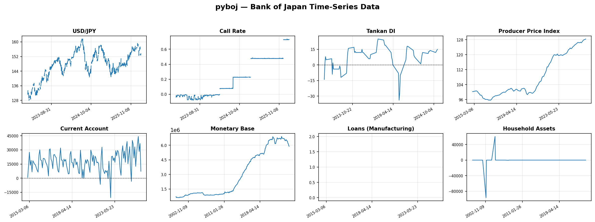

# pyboj

Python client for the [Bank of Japan Time-Series Statistics API](https://www.stat-search.boj.or.jp/).

[](https://pypi.org/project/pyboj/)
[](https://opensource.org/licenses/MIT)
[](https://www.python.org/downloads/)
[](https://colab.research.google.com/github/obichan117/pyboj/blob/main/examples/quickstart.ipynb)

Wraps the official BOJ API ([announced 2026-02-18](https://www.boj.or.jp/statistics/outline/notice_2026/not260218a.htm)) for machine-readable access to Japan's central bank time-series data.

<p align="center">
  
</p>

## Installation

```bash
pip install pyboj            # includes pandas
pip install pyboj[plot]      # + matplotlib & japanize-matplotlib for built-in plotting
pip install boj-ts-api       # low-level client only (no pandas)
```

## Quick Start

```python
from pyboj import BOJ, Currency, Frequency

boj = BOJ()  # defaults to Japanese (lang=Lang.JP)

# Exchange rates — no magic strings
rates = boj.exchange_rates(
    currency=Currency.USD_JPY,
    frequency=Frequency.D,
    start_date="202401",
)
r = rates[0]
print(r.currency_pair, r.rate_type, r.values[:3])
df = r.to_dataframe()  # pandas DataFrame

# One-liner plot with Japanese labels
r.plot()  # auto title & ylabel from series metadata
```

```python
# All 13 BOJ categories supported
rates = boj.interest_rates(frequency=Frequency.D)
indices = boj.price_indices(start_date="202401")
bop = boj.balance_of_payments()
money = boj.money_deposits()
loans = boj.loans()

# Use lang=Lang.EN for English labels
from pyboj import Lang
boj_en = BOJ(lang=Lang.EN)
```

## API Overview

### `BOJ` Client Methods

Every method returns typed domain objects with parsed dates, numeric values, and `to_dataframe()`.

| Method | Returns | Filter Enums | Default DB |
|--------|---------|-------------|------------|
| `exchange_rates()` | `list[ExchangeRate]` | `Currency`, `RateType` | FM08 |
| `interest_rates()` | `list[InterestRate]` | `RateCategory`, `Collateralization` | FM01 |
| `price_indices()` | `list[PriceIndex]` | `IndexType` | PR01 |
| `tankan()` | `list[Tankan]` | `TankanIndustry`, `TankanSize`, `TankanItem`, `TankanSeriesType`, `TankanTiming` | CO |
| `balance_of_payments()` | `list[BalanceOfPayments]` | `BopAccount` | BP01 |
| `money_deposits()` | `list[MoneyDeposit]` | `MonetaryComponent`, `Adjustment` | MD01 |
| `loans()` | `list[Loan]` | `IndustrySector` | LA01 |
| `financial_markets()` | `list[FinancialMarket]` | `MarketSegment`, `InstrumentType` | FM03 |
| `balance_sheets()` | `list[BalanceSheet]` | `AccountSide`, `InstitutionType` | BS01 |
| `flow_of_funds()` | `list[FlowOfFunds]` | `FofSector`, `FofInstrument` | FF |
| `boj_operations()` | `list[BOJOperation]` | `OperationType` | OB01 |
| `public_finance()` | `list[PublicFinance]` | `FiscalItem` | PF01 |
| `international()` | `list[InternationalStat]` | `StatCategory` | BIS |
| `metadata()` | `list[MetadataRecord]` | — | — |

All methods accept `frequency`, `start_date`, `end_date`. Methods with a default DB accept a `db` parameter to query other databases (e.g. `db=Database.MONEY_STOCK`).

### Domain Wrapper Properties

Every domain object inherits from `Series`:

| Property | Type | Description |
|----------|------|-------------|
| `series_code` | `str` | BOJ series code |
| `name` / `name_jp` | `str \| None` | English / Japanese series name |
| `unit` / `unit_jp` | `str \| None` | Unit label |
| `frequency` | `str \| None` | Frequency string (e.g. `"DAILY"`) |
| `dates` | `list[datetime.date]` | Parsed survey dates |
| `values` | `list[float \| None]` | Numeric values |
| `to_dataframe()` | `DataFrame` | pandas DataFrame with DatetimeIndex |
| `plot()` | `Axes` | One-liner matplotlib plot (`pip install pyboj[plot]`) |

Subclasses add domain-specific properties (e.g. `ExchangeRate.currency_pair`, `InterestRate.tenor`, `PriceIndex.base_year`).

### `Database` Enum (43 databases)

Named constants for all BOJ database codes — use instead of magic strings:

| Category | Databases |
|----------|-----------|
| Interest Rates | `IR01`–`IR04` |
| Financial Markets | `FM01`–`FM09` |
| Money & Deposits | `MD01`–`MD14` |
| Loans | `LA01`–`LA05` |
| Balance Sheets | `BS01`–`BS02` |
| Flow of Funds | `FF` |
| BOJ Operations | `OB01`–`OB02` |
| TANKAN | `CO` |
| Prices | `PR01`–`PR04` |
| Public Finance | `PF01`–`PF02` |
| Balance of Payments | `BP01` |
| International | `BIS`, `DER`, `PS01`, `PS02`, `OT` |

## Features

- **`BOJ` client** — typed domain methods for all 13 BOJ categories (43 databases)
- **Japanese-first** — defaults to `Lang.JP`; use `Lang.EN` for English
- **Built-in plotting** — `series.plot()` with Japanese labels and `japanize-matplotlib` (`pip install pyboj[plot]`)
- **Enum-driven filtering** — `Currency`, `RateType`, `TankanIndustry`, `BopAccount`, etc.
- **Domain wrappers** — `ExchangeRate`, `InterestRate`, `PriceIndex`, `Tankan`, and more
- **Metadata-driven** — auto-fetches metadata and filters series by your criteria
- **Sync & async** low-level clients with identical API surface
- **Pydantic v2** models for type-safe, validated responses
- **Auto-pagination** via `iter_data_code()` / `iter_data_layer()` generators
- **CSV + pandas** support with `to_dataframe()` and `csv_to_dataframe()`
- **PEP 561** typed package

## Packages

| Package | Install | Description |
|---------|---------|-------------|
| **pyboj** | `pip install pyboj` | High-level client with domain wrappers (includes pandas) |
| **pyboj[plot]** | `pip install pyboj[plot]` | + matplotlib & japanize-matplotlib for `series.plot()` |
| **boj-ts-api** | `pip install boj-ts-api` | Low-level typed API client |

## Low-Level API

For direct, typed API access without domain wrappers, see [boj-ts-api](packages/boj-ts-api/).

## Documentation

- [Getting Started](https://obichan117.github.io/pyboj/getting-started/)
- [API Reference](https://obichan117.github.io/pyboj/api-reference/)
- [Upstream BOJ API Reference](https://obichan117.github.io/pyboj/boj-api/)
- [OpenAPI Specification (Interactive)](https://obichan117.github.io/pyboj/openapi-spec/)

## Official BOJ Resources

- [BOJ API Announcement (2026-02-18)](https://www.boj.or.jp/statistics/outline/notice_2026/not260218a.htm)
- [BOJ Time-Series Search Site](https://www.stat-search.boj.or.jp/)

## License

MIT
